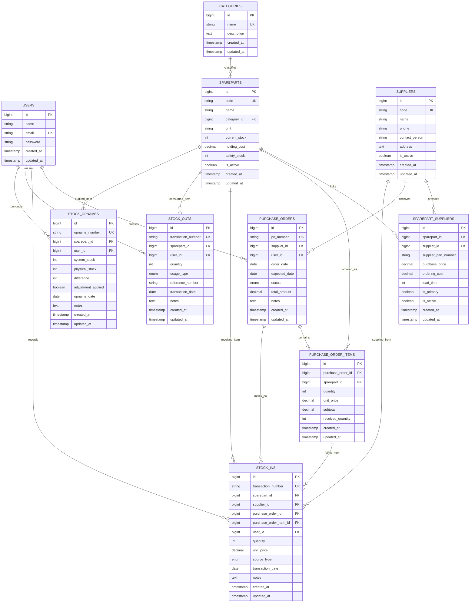

# DATABASE DESIGN & ENTITY RELATIONSHIP DIAGRAM (ERD)

## Workshop Inventory Management System
### Sistem Manajemen Persediaan Sparepart Bengkel Motor Berbasis EOQ dan ROP

**Versi Dokumen:** 1.0  
**Status:** Baseline Perancangan Database & API Contract  
**Database Engine:** MySQL 8.0+ / InnoDB  
**ORM Target:** Laravel 13 Eloquent  
**Rujukan:** [prd.md](file:///d:/bengkel_Ryan/prd.md) (Versi 1.1)

---

# A. Entity List

Berikut adalah daftar entitas final yang dirancang untuk mendukung seluruh kebutuhan operasional bengkel, analisis EOQ/ROP, pengadaan, dan auditability tanpa redundansi:

1. `users` — Akun administrator/pemilik bengkel (Admin/Owner).
2. `categories` — Kategori klasifikasi sparepart.
3. `spareparts` — Master data barang/sparepart dan parameter persediaan internal.
4. `suppliers` — Master data pemasok/distributor sparepart.
5. `sparepart_suppliers` — Tabel relasi N:N antara sparepart dan supplier (menyimpan parameter harga beli, ordering cost, lead time, dan status supplier utama/cadangan).
6. `purchase_orders` — Header dokumen rencana pemesanan barang kepada supplier.
7. `purchase_order_items` — Rincian item barang pada Purchase Order.
8. `stock_ins` — Pencatatan transaksi penerimaan barang fisik ke gudang (dari PO, pembelian langsung, retur, atau penyesuaian).
9. `stock_outs` — Pencatatan transaksi pengeluaran/pemakaian sparepart (servis, penjualan langsung, penyesuaian).
10. `stock_opnames` — Pencatatan rekonsiliasi stok fisik versus stok sistem serta koreksi stok.

---

# B. Entity Responsibility

| Entitas | Tanggung Jawab & Deskripsi Data | Alasan Diperlukan |
| :--- | :--- | :--- |
| **`users`** | Menyimpan kredensial dan data profil Admin/Owner bengkel untuk autentikasi via Laravel Sanctum. | Sistem berbasis web memerlukan autentikasi tunggal yang aman untuk menjaga integritas data dan mencatat penanggung jawab transaksi (`user_id`). |
| **`categories`** | Mengelompokkan jenis sparepart (misal: Mesin, Rem, Kelistrikan, Oli, CVT, Ban). | Memudahkan filter, pencarian, pelaporan, dan kategorisasi persediaan di bengkel. |
| **`spareparts`** | Menyimpan identitas tunggal sparepart, unit satuan, stok saat ini (`current_stock`), holding cost per unit, dan safety stock dasar. | Menjadi master data persediaan utama dan *single source of truth* untuk stok fisik bengkel. |
| **`suppliers`** | Menyimpan profil vendor/penyedia sparepart (nama, kontak, telepon, alamat). | Bengkel membeli sparepart dari berbagai toko/distributor (baik toko langganan utama maupun alternatif). |
| **`sparepart_suppliers`** | Menyimpan relasi multi-supplier untuk tiap sparepart beserta atribut unik per vendor: harga beli (`purchase_price`), biaya pemesanan (`ordering_cost`), waktu tunggu (`lead_time`), dan penanda supplier utama (`is_primary`). | **Krusial untuk PRD:** Satu sparepart bisa dibeli dari lebih dari satu supplier dengan harga, lead time, dan ordering cost yang berbeda. Tidak boleh disimpan di tabel `spareparts`. |
| **`purchase_orders`** | Menyimpan header pesanan pengadaan (nomor PO, tanggal, status pengadaan, total estimasi). | Memisahkan status "rencana pengadaan" dari "barang masuk fisik" agar stok tidak bertambah sebelum barang tiba. |
| **`purchase_order_items`** | Menyimpan daftar barang dalam PO, kuantitas dipesan, harga disepakati, dan kuantitas yang sudah diterima (`received_quantity`). | Mendukung pemesanan multi-item dan mekanisme penerimaan bertahap (*partial receiving*). |
| **`stock_ins`** | Mencatat setiap peristiwa fisik penambahan stok ke bengkel beserta kuantitas, harga, sumber transaksi, dan referensi PO (jika ada). | Menjamin riwayat penambahan stok terlacak, atomik, dan menjadi pemicu penambahan `current_stock`. |
| **`stock_outs`** | Mencatat peristiwa pengurangan sparepart beserta tipe pemakaian (servis pelanggan, penjualan retail, atau koreksi) dan tanggal transaksi. | Menjadi **sumber data historis demand** untuk perhitungan EOQ dan ROP, serta memicu pengurangan `current_stock`. |
| **`stock_opnames`** | Mencatat hasil audit fisik periodik, selisih (*variance*), dan status penyesuaian stok. | Menyediakan jejak audit jika terjadi ketidaksesuaian antara stok sistem dan stok riil di rak bengkel. |

---

# C. Relationship Matrix

| Parent Entity | Child Entity | Cardinality | Foreign Key | On Delete | On Update | Penjelasan Bisnis |
| :--- | :--- | :---: | :--- | :--- | :--- | :--- |
| `categories` | `spareparts` | 1 : N | `category_id` | `RESTRICT` | `CASCADE` | Kategori tidak boleh dihapus jika masih ada sparepart yang menggunakannya. |
| `spareparts` | `sparepart_suppliers` | 1 : N | `sparepart_id` | `CASCADE` | `CASCADE` | Jika master sparepart dihapus (atau di-purge), relasi supplier-nya terhapus. |
| `suppliers` | `sparepart_suppliers` | 1 : N | `supplier_id` | `RESTRICT` | `CASCADE` | Supplier tidak boleh dihapus jika masih menjadi rekanan sparepart aktif. |
| `suppliers` | `purchase_orders` | 1 : N | `supplier_id` | `RESTRICT` | `CASCADE` | Supplier yang memiliki histori PO tidak boleh dihapus dari basis data. |
| `purchase_orders` | `purchase_order_items`| 1 : N | `purchase_order_id`| `CASCADE`| `CASCADE` | Item PO melekat pada header PO. |
| `spareparts` | `purchase_order_items`| 1 : N | `sparepart_id` | `RESTRICT` | `CASCADE` | Sparepart tidak boleh dihapus jika terdapat dalam riwayat PO. |
| `spareparts` | `stock_ins` | 1 : N | `sparepart_id` | `RESTRICT` | `CASCADE` | Riwayat stok masuk sparepart wajib dipertahankan untuk audit transaksi. |
| `suppliers` | `stock_ins` | 1 : N | `supplier_id` | `SET NULL` / `RESTRICT` | `CASCADE` | Referensi supplier pada penerimaan barang (opsional jika bukan dari supplier). |
| `purchase_orders` | `stock_ins` | 1 : N | `purchase_order_id`| `SET NULL` | `CASCADE` | Menghubungkan penerimaan barang dengan dokumen PO asal jika ada. |
| `purchase_order_items`| `stock_ins`| 1 : N | `purchase_order_item_id` | `SET NULL` | `CASCADE` | Menautkan baris penerimaan ke baris spesifik item PO untuk validasi kuantitas. |
| `spareparts` | `stock_outs` | 1 : N | `sparepart_id` | `RESTRICT` | `CASCADE` | Data pemakaian sparepart adalah histori demand permanen. |
| `spareparts` | `stock_opnames` | 1 : N | `sparepart_id` | `RESTRICT` | `CASCADE` | Riwayat opname harus tetap tersimpan untuk audit inventaris. |
| `users` | `purchase_orders` | 1 : N | `user_id` | `RESTRICT` | `CASCADE` | Mencatat user yang menerbitkan PO. |
| `users` | `stock_ins` | 1 : N | `user_id` | `RESTRICT` | `CASCADE` | Mencatat user yang memproses stok masuk. |
| `users` | `stock_outs` | 1 : N | `user_id` | `RESTRICT` | `CASCADE` | Mencatat user yang mencatat pengeluaran barang. |
| `users` | `stock_opnames` | 1 : N | `user_id` | `RESTRICT` | `CASCADE` | Mencatat user yang mengeksekusi opname fisik. |

---

# D. Entity Relationship Diagram (ERD)



---

# E. Database Schema Specification

### 1. `users`
Tabel penyimpan kredensial pemilik bengkel untuk login sistem.

| Column | Type | Null | Key | Default | Description |
| :--- | :--- | :---: | :---: | :--- | :--- |
| `id` | `BIGINT UNSIGNED` | NO | PK | *Auto Increment* | Primary key pengguna |
| `name` | `VARCHAR(100)` | NO | | | Nama lengkap pemilik/admin |
| `email` | `VARCHAR(100)` | NO | UK | | Email unik untuk autentikasi |
| `password` | `VARCHAR(255)` | NO | | | Password hash (bcrypt / argon2id) |
| `remember_token` | `VARCHAR(100)` | YES | | NULL | Token session Laravel |
| `created_at` | `TIMESTAMP` | YES | | NULL | Waktu pembuatan akun |
| `updated_at` | `TIMESTAMP` | YES | | NULL | Waktu perubahan akun |

---

### 2. `categories`
Tabel klasifikasi sparepart bengkel.

| Column | Type | Null | Key | Default | Description |
| :--- | :--- | :---: | :---: | :--- | :--- |
| `id` | `BIGINT UNSIGNED` | NO | PK | *Auto Increment* | Primary key kategori |
| `name` | `VARCHAR(100)` | NO | UK | | Nama kategori (misal: Mesin, Rem, Oli, CVT) |
| `description` | `TEXT` | YES | | NULL | Keterangan kelompok kategori |
| `created_at` | `TIMESTAMP` | YES | | NULL | Timestamp pembuatan |
| `updated_at` | `TIMESTAMP` | YES | | NULL | Timestamp perubahan |

---

### 3. `spareparts`
Tabel master sparepart dan persediaan internal.

| Column | Type | Null | Key | Default | Description |
| :--- | :--- | :---: | :---: | :--- | :--- |
| `id` | `BIGINT UNSIGNED` | NO | PK | *Auto Increment* | Primary key sparepart |
| `code` | `VARCHAR(50)` | NO | UK | | Kode unik internal sparepart (misal: `PRT-BRK-001`) |
| `name` | `VARCHAR(150)` | NO | | | Nama sparepart (misal: Kampas Rem Depan Vario 150) |
| `category_id` | `BIGINT UNSIGNED` | NO | FK | | Referensi ke `categories.id` |
| `unit` | `VARCHAR(20)` | NO | | 'pcs' | Satuan hitung fisik (misal: pcs, botol, set, pack) |
| `current_stock` | `INT UNSIGNED` | NO | | 0 | Stok fisik aktual di bengkel |
| `holding_cost` | `DECIMAL(12, 2)` | NO | | 0.00 | Biaya simpan per unit per periode analisis ($H$) |
| `safety_stock` | `INT UNSIGNED` | NO | | 0 | Safety stock dasar yang ditetapkan ($SS$) |
| `is_active` | `BOOLEAN` | NO | | TRUE | Flag status aktif operasional |
| `created_at` | `TIMESTAMP` | YES | | NULL | Timestamp pembuatan data |
| `updated_at` | `TIMESTAMP` | YES | | NULL | Timestamp pembaruan data |

---

### 4. `suppliers`
Tabel master data pemasok/distributor.

| Column | Type | Null | Key | Default | Description |
| :--- | :--- | :---: | :---: | :--- | :--- |
| `id` | `BIGINT UNSIGNED` | NO | PK | *Auto Increment* | Primary key supplier |
| `code` | `VARCHAR(50)` | NO | UK | | Kode unik supplier (misal: `SPL-AHM-01`) |
| `name` | `VARCHAR(150)` | NO | | | Nama toko grosir/distributor sparepart |
| `phone` | `VARCHAR(25)` | YES | | NULL | Nomor kontak telepon/WhatsApp |
| `contact_person`| `VARCHAR(100)` | YES | | NULL | Nama sales / penanggung jawab di pihak toko |
| `address` | `TEXT` | YES | | NULL | Alamat fisik distributor |
| `is_active` | `BOOLEAN` | NO | | TRUE | Flag keaktifan supplier |
| `created_at` | `TIMESTAMP` | YES | | NULL | Timestamp pembuatan |
| `updated_at` | `TIMESTAMP` | YES | | NULL | Timestamp pembaruan |

---

### 5. `sparepart_suppliers`
Tabel pivot N:N yang menghubungkan sparepart dengan pemasoknya beserta parameter EOQ & pengadaan.

| Column | Type | Null | Key | Default | Description |
| :--- | :--- | :---: | :---: | :--- | :--- |
| `id` | `BIGINT UNSIGNED` | NO | PK | *Auto Increment* | Primary key relasi |
| `sparepart_id` | `BIGINT UNSIGNED` | NO | FK | | Referensi ke `spareparts.id` |
| `supplier_id` | `BIGINT UNSIGNED` | NO | FK | | Referensi ke `suppliers.id` |
| `supplier_part_number` | `VARCHAR(100)` | YES | | NULL | Nomor part menurut katalog supplier tertentu |
| `purchase_price` | `DECIMAL(12, 2)` | NO | | 0.00 | Harga beli per unit dari supplier ini |
| `ordering_cost` | `DECIMAL(12, 2)` | NO | | 0.00 | Biaya pemesanan ($S$) per transaksi order |
| `lead_time` | `INT UNSIGNED` | NO | | 1 | Waktu tunggu pengiriman ($L$) dalam satuan hari |
| `is_primary` | `BOOLEAN` | NO | | FALSE | Indikator supplier utama (`TRUE` = prioritas utama) |
| `is_active` | `BOOLEAN` | NO | | TRUE | Status ketersediaan pasokan dari supplier ini |
| `created_at` | `TIMESTAMP` | YES | | NULL | Timestamp pembuatan |
| `updated_at` | `TIMESTAMP` | YES | | NULL | Timestamp pembaruan |

---

### 6. `purchase_orders`
Tabel header pemesanan pengadaan sparepart ke supplier.

| Column | Type | Null | Key | Default | Description |
| :--- | :--- | :---: | :---: | :--- | :--- |
| `id` | `BIGINT UNSIGNED` | NO | PK | *Auto Increment* | Primary key PO |
| `po_number` | `VARCHAR(50)` | NO | UK | | Nomor resmi dokumen PO (misal: `PO-202609-0001`) |
| `supplier_id` | `BIGINT UNSIGNED` | NO | FK | | Pemasok yang dituju |
| `user_id` | `BIGINT UNSIGNED` | NO | FK | | User pembuat PO (Admin/Owner) |
| `order_date` | `DATE` | NO | | (CURRENT_DATE)| Tanggal pemesanan diajukan |
| `expected_date` | `DATE` | YES | | NULL | Estimasi tanggal barang tiba (`order_date + lead_time`) |
| `status` | `VARCHAR(25)` | NO | IDX | 'DRAFT' | Nilai: `DRAFT`, `ORDERED`, `PARTIALLY_RECEIVED`, `RECEIVED`, `CANCELLED` |
| `total_amount` | `DECIMAL(14, 2)` | NO | | 0.00 | Total estimasi nilai PO (sum of item subtotals) |
| `notes` | `TEXT` | YES | | NULL | Catatan tambahan untuk pengadaan |
| `created_at` | `TIMESTAMP` | YES | | NULL | Timestamp pembuatan |
| `updated_at` | `TIMESTAMP` | YES | | NULL | Timestamp pembaruan |

---

### 7. `purchase_order_items`
Tabel rincian barang yang dipesan dalam satu Purchase Order.

| Column | Type | Null | Key | Default | Description |
| :--- | :--- | :---: | :---: | :--- | :--- |
| `id` | `BIGINT UNSIGNED` | NO | PK | *Auto Increment* | Primary key item PO |
| `purchase_order_id` | `BIGINT UNSIGNED` | NO | FK | | Referensi ke `purchase_orders.id` |
| `sparepart_id` | `BIGINT UNSIGNED` | NO | FK | | Referensi ke `spareparts.id` |
| `quantity` | `INT UNSIGNED` | NO | | | Kuantitas yang dipesan (dari hasil EOQ / penyesuaian) |
| `unit_price` | `DECIMAL(12, 2)` | NO | | 0.00 | Harga satuan beli saat PO dibuat |
| `subtotal` | `DECIMAL(14, 2)` | NO | | 0.00 | `quantity * unit_price` |
| `received_quantity` | `INT UNSIGNED` | NO | | 0 | Kuantitas fisik yang telah diterima bertahap |
| `created_at` | `TIMESTAMP` | YES | | NULL | Timestamp pembuatan |
| `updated_at` | `TIMESTAMP` | YES | | NULL | Timestamp pembaruan |

---

### 8. `stock_ins`
Tabel pencatatan mutasi penambahan stok barang fisik secara riil.

| Column | Type | Null | Key | Default | Description |
| :--- | :--- | :---: | :---: | :--- | :--- |
| `id` | `BIGINT UNSIGNED` | NO | PK | *Auto Increment* | Primary key transaksi masuk |
| `transaction_number`| `VARCHAR(50)` | NO | UK | | Nomor unik transaksi masuk (misal: `IN-202609-0001`) |
| `sparepart_id` | `BIGINT UNSIGNED` | NO | FK | | Sparepart yang bertambah |
| `supplier_id` | `BIGINT UNSIGNED` | YES | FK | NULL | Supplier asal barang (jika sumber pembelian) |
| `purchase_order_id` | `BIGINT UNSIGNED` | YES | FK | NULL | Referensi PO jika berasal dari penerimaan PO |
| `purchase_order_item_id` | `BIGINT UNSIGNED` | YES | FK | NULL | Referensi item PO spesifik |
| `user_id` | `BIGINT UNSIGNED` | NO | FK | | User yang mencatat transaksi |
| `quantity` | `INT UNSIGNED` | NO | | | Kuantitas fisik barang yang masuk (> 0) |
| `unit_price` | `DECIMAL(12, 2)` | NO | | 0.00 | Harga per unit barang saat diterima |
| `source_type` | `VARCHAR(25)` | NO | | 'PURCHASE_ORDER' | Nilai: `PURCHASE_ORDER`, `DIRECT_PURCHASE`, `CUSTOMER_RETURN`, `ADJUSTMENT` |
| `transaction_date` | `DATE` | NO | IDX | (CURRENT_DATE)| Tanggal fisik barang diterima |
| `notes` | `TEXT` | YES | | NULL | Keterangan/catatan faktur surat jalan |
| `created_at` | `TIMESTAMP` | YES | | NULL | Timestamp pencatatan sistem |
| `updated_at` | `TIMESTAMP` | YES | | NULL | Timestamp pembaruan |

---

### 9. `stock_outs`
Tabel pencatatan pemakaian dan penjualan sparepart (sumber utama Demand).

| Column | Type | Null | Key | Default | Description |
| :--- | :--- | :---: | :---: | :--- | :--- |
| `id` | `BIGINT UNSIGNED` | NO | PK | *Auto Increment* | Primary key transaksi keluar |
| `transaction_number`| `VARCHAR(50)` | NO | UK | | Nomor unik transaksi keluar (misal: `OUT-202609-0001`)|
| `sparepart_id` | `BIGINT UNSIGNED` | NO | FK | | Sparepart yang keluar |
| `user_id` | `BIGINT UNSIGNED` | NO | FK | | User pencatat transaksi |
| `quantity` | `INT UNSIGNED` | NO | | | Kuantitas yang keluar (> 0) |
| `usage_type` | `VARCHAR(25)` | NO | | 'SERVICE' | Nilai: `SERVICE` (bengkel), `SALE` (penjualan ecer), `ADJUSTMENT` |
| `reference_number` | `VARCHAR(100)` | YES | | NULL | Nomor nopol motor / nota servis manual pelanggan |
| `transaction_date` | `DATE` | NO | IDX | (CURRENT_DATE)| Tanggal barang digunakan |
| `notes` | `TEXT` | YES | | NULL | Catatan pengerjaan servis/keluhan |
| `created_at` | `TIMESTAMP` | YES | | NULL | Timestamp pencatatan sistem |
| `updated_at` | `TIMESTAMP` | YES | | NULL | Timestamp pembaruan |

---

### 10. `stock_opnames`
Tabel rekonsiliasi stok fisik dan audit selisih.

| Column | Type | Null | Key | Default | Description |
| :--- | :--- | :---: | :---: | :--- | :--- |
| `id` | `BIGINT UNSIGNED` | NO | PK | *Auto Increment* | Primary key opname |
| `opname_number` | `VARCHAR(50)` | NO | UK | | Nomor dokumen opname (misal: `OPN-202609-0001`) |
| `sparepart_id` | `BIGINT UNSIGNED` | NO | FK | | Sparepart yang diaudit |
| `user_id` | `BIGINT UNSIGNED` | NO | FK | | User pelaksana opname |
| `system_stock` | `INT` | NO | | | Nilai `current_stock` saat opname dimulai |
| `physical_stock` | `INT UNSIGNED` | NO | | | Jumlah fisik nyata hasil hitung di rak bengkel |
| `difference` | `INT` | NO | | | Hasil kalkulasi: `physical_stock - system_stock` |
| `adjustment_applied`| `BOOLEAN` | NO | | FALSE | Status apakah koreksi stok sudah disetujui & diterapkan |
| `opname_date` | `DATE` | NO | IDX | (CURRENT_DATE)| Tanggal pelaksanaan opname |
| `notes` | `TEXT` | YES | | NULL | Alasan selisih (rusak, hilang, lupa dicatat) |
| `created_at` | `TIMESTAMP` | YES | | NULL | Timestamp pembuatan |
| `updated_at` | `TIMESTAMP` | YES | | NULL | Timestamp pembaruan |

---

# F. Constraints & Data Integrity Rules

### 1. Primary Keys (PK)
Seluruh tabel menggunakan `id BIGINT UNSIGNED AUTO_INCREMENT` yang menjamin performa indeks seragam, efisiensi B-Tree pada InnoDB, dan kompatibilitas standar Laravel Eloquent.

### 2. Foreign Keys (FK) & Referential Actions
- `categories.id` ← `spareparts.category_id`: `ON DELETE RESTRICT ON UPDATE CASCADE`
- `spareparts.id` ← `sparepart_suppliers.sparepart_id`: `ON DELETE CASCADE ON UPDATE CASCADE`
- `suppliers.id` ← `sparepart_suppliers.supplier_id`: `ON DELETE RESTRICT ON UPDATE CASCADE`
- `suppliers.id` ← `purchase_orders.supplier_id`: `ON DELETE RESTRICT ON UPDATE CASCADE`
- `purchase_orders.id` ← `purchase_order_items.purchase_order_id`: `ON DELETE CASCADE ON UPDATE CASCADE`
- `spareparts.id` ← `purchase_order_items.sparepart_id`: `ON DELETE RESTRICT ON UPDATE CASCADE`
- `spareparts.id` ← `stock_ins.sparepart_id`: `ON DELETE RESTRICT ON UPDATE CASCADE`
- `suppliers.id` ← `stock_ins.supplier_id`: `ON DELETE RESTRICT ON UPDATE CASCADE` (nullable)
- `purchase_orders.id` ← `stock_ins.purchase_order_id`: `ON DELETE SET NULL ON UPDATE CASCADE`
- `purchase_order_items.id` ← `stock_ins.purchase_order_item_id`: `ON DELETE SET NULL ON UPDATE CASCADE`
- `spareparts.id` ← `stock_outs.sparepart_id`: `ON DELETE RESTRICT ON UPDATE CASCADE`
- `spareparts.id` ← `stock_opnames.sparepart_id`: `ON DELETE RESTRICT ON UPDATE CASCADE`
- `users.id` ← Relasi user pada transaksi: `ON DELETE RESTRICT ON UPDATE CASCADE`

### 3. Unique Constraints
- `users.email` (UK)
- `categories.name` (UK)
- `spareparts.code` (UK)
- `suppliers.code` (UK)
- `purchase_orders.po_number` (UK)
- `stock_ins.transaction_number` (UK)
- `stock_outs.transaction_number` (UK)
- `stock_opnames.opname_number` (UK)
- `sparepart_suppliers`: `UNIQUE KEY uq_sparepart_supplier (sparepart_id, supplier_id)` — Mencegah satu supplier dipetakan ganda ke sparepart yang sama.
- `purchase_order_items`: `UNIQUE KEY uq_po_sparepart (purchase_order_id, sparepart_id)` — Mencegah duplikasi baris barang yang sama dalam satu dokumen PO.

### 4. Check Constraints (MySQL 8.0+ & Enforced in Laravel FormRequest)
1. `chk_spareparts_stock`: `current_stock >= 0` (Stok dilarang negatif).
2. `chk_spareparts_holding`: `holding_cost >= 0`.
3. `chk_sp_suppliers_price`: `purchase_price >= 0`.
4. `chk_sp_suppliers_ordering`: `ordering_cost >= 0`.
5. `chk_sp_suppliers_lead`: `lead_time >= 0`.
6. `chk_stock_ins_qty`: `quantity > 0` (Kuantitas masuk wajib positif).
7. `chk_stock_outs_qty`: `quantity > 0` (Kuantitas keluar wajib positif).
8. `chk_po_items_qty`: `quantity > 0`.
9. `chk_po_items_received`: `received_quantity >= 0 AND received_quantity <= quantity` (Barang diterima tidak boleh melebihi kuantitas yang dipesan).

### 5. Aturan Supplier Utama Tunggal (`is_primary`)
- **Tantangan:** MySQL tidak mendukung *partial unique index* (`WHERE is_primary = 1`).
- **Solusi Arsitektur:**
  1. Di level database, constraint integritas dasar dijaga oleh `UNIQUE(sparepart_id, supplier_id)`.
  2. Di level aplikasi (Laravel Service Layer), saat menyimpan atau mengubah relasi dengan `is_primary = true`, sistem menjalankan DB Transaction yang secara otomatis menonaktifkan flag `is_primary = false` pada supplier lain untuk sparepart tersebut. Hal ini menjamin bahwa tepat satu supplier utama yang aktif per sparepart tanpa kerumitan trigger SQL yang sulit di-maintain.

---

# G. Indexing Strategy

Pemberian indeks dirancang secara presisi berdasarkan query pattern untuk kalkulasi EOQ/ROP, pencarian inventaris, dan filtering laporan:

| Tabel | Kolom Terindeks | Tipe Indeks | Alasan & Pola Query |
| :--- | :--- | :---: | :--- |
| `spareparts` | `code` | UNIQUE | Pencarian cepat berdasarkan scan barcode / kode barang. |
| `spareparts` | `category_id` | B-TREE | Filter daftar barang per kategori pada katalog dan inventory grid. |
| `spareparts` | `is_active` | B-TREE | Filter barang aktif saat operasional dan kalkulasi rekomendasi. |
| `suppliers` | `code` | UNIQUE | Identifikasi unik supplier. |
| `sparepart_suppliers`| `sparepart_id`, `is_primary` | B-TREE | **Query Inti EOQ/ROP:** Mengambil parameter supplier utama (`ordering_cost`, `lead_time`, `purchase_price`) dalam 1 hit. |
| `sparepart_suppliers`| `supplier_id` | B-TREE | Menampilkan daftar seluruh sparepart yang dipasok oleh supplier tertentu. |
| `stock_outs` | `sparepart_id`, `transaction_date` | **COMPOSITE** | **Query Inti Demand EOQ:** `WHERE sparepart_id = ? AND transaction_date BETWEEN ? AND ?` untuk agregasi `SUM(quantity)`. |
| `stock_ins` | `sparepart_id`, `transaction_date` | **COMPOSITE** | Laporan riwayat barang masuk dan evaluasi frekuensi restock per periode. |
| `stock_ins` | `purchase_order_id` | B-TREE | Tracing penerimaan barang dari dokumen PO. |
| `purchase_orders` | `status` | B-TREE | Filter dashboard untuk menampilkan PO aktif (`DRAFT`, `ORDERED`, `PARTIALLY_RECEIVED`). |
| `purchase_orders` | `supplier_id` | B-TREE | Rekapitulasi histori transaksi pemesanan per supplier. |
| `purchase_order_items`| `purchase_order_id`| B-TREE | Join cepat header-detail saat menampilkan invoice atau form penerimaan PO. |
| `purchase_order_items`| `sparepart_id` | B-TREE | Pengecekan apakah sparepart sedang memiliki pesanan berjalan yang belum tiba. |
| `stock_opnames` | `sparepart_id`, `opname_date` | COMPOSITE | Histori audit dan pelacakan rekonsiliasi fisik barang. |

---

# H. Normalization Review

Desain basis data ini telah dianalisis memenuhi kriteria **Third Normal Form (3NF)**:

1. **First Normal Form (1NF):**
   - Seluruh tabel memiliki Primary Key tunggal yang unik.
   - Tidak ada kolom dengan nilai jamak (*repeating groups* / multivalued attributes).
   - Setiap atribut bersifat atomik (misal: kuantitas, tanggal, nomor transaksi, harga).

2. **Second Normal Form (2NF):**
   - Seluruh atribut non-key bergantung penuh secara fungsional (*fully functionally dependent*) pada primary key masing-masing entitas.
   - Tabel pivot `sparepart_suppliers` dan `purchase_order_items` memisahkan atribut yang bergantung pada relasi komposit sehingga tidak ada ketergantungan parsial pada tabel master.

3. **Third Normal Form (3NF):**
   - Tidak ada ketergantungan transitif (*transitive dependency*).
   - **Evaluasi Parameter Supplier:** `purchase_price`, `ordering_cost`, dan `lead_time` tidak diletakkan di `spareparts` karena nilai-nilai tersebut bergantung pada kombinasi sparepart dan supplier penyedianya, bukan semata-mata pada identitas sparepart.
   - **Evaluasi Status Persediaan:** Status stok (`NORMAL`, `PERLU PESAN`, `STOK HABIS`) **TIDAK DISIMPAN** sebagai kolom fisik tabel `spareparts`. Status tersebut sepenuhnya dihitung secara dinamis dari perbandingan `current_stock` dan `ROP` untuk mencegah inkonsistensi data.

### Analisis Denormalisasi Terkendali (Controlled Denormalization):
1. **`spareparts.current_stock`:**
   - Secara teori absolut, stok dapat dihitung sebagai `SUM(stock_ins) - SUM(stock_outs) + SUM(opname_difference)`. Namun, dalam sistem operasional nyata, menghitung agregasi seluruh tabel transaksi setiap kali halaman inventaris atau form kasir dibuka akan menyebabkan penurunan performa query drastis seiring bertambahnya data transaksi.
   - Oleh karena itu, `current_stock` disimpan sebagai nilai terkini di `spareparts` dengan jaminan **integritas atomik**: setiap mutasi stok di backend wajib dibungkus dalam `DB::transaction()` dengan pessimistic locking (`lockForUpdate()`).
2. **`purchase_orders.total_amount` dan `purchase_order_items.subtotal`:**
   - Menyimpan hasil perkalian kuantitas dan harga satuan saat PO dibuat. Hal ini menjamin nilai historis pengadaan tetap valid meskipun di masa mendatang harga di `sparepart_suppliers` mengalami fluktuasi.

---

# I. Business Rules → Database Mapping

| Business Rule (PRD v1.1) | Implementasi Database | Mekanisme Penegakan |
| :--- | :--- | :--- |
| **BR-01: Kode sparepart unik** | `spareparts.code` | Database `UNIQUE KEY` |
| **BR-02: Quantity transaksi > 0** | `stock_ins.quantity`, `stock_outs.quantity`, `purchase_order_items.quantity` | Database `CHECK (quantity > 0)` & Laravel FormRequest validation |
| **BR-03: Stock Out dilarang menyebabkan stok negatif** | `spareparts.current_stock` | Database `CHECK (current_stock >= 0)` + Backend lock check `quantity <= current_stock` |
| **BR-04 & BR-05: Mutasi stok fisik** | `stock_ins` menambah `current_stock`, `stock_outs` mengurangi `current_stock` | Service layer di dalam `DB::transaction()` atomik |
| **BR-06: Stock Opname mencatat selisih sistem vs fisik** | `stock_opnames.difference = physical_stock - system_stock` | Tercatat permanen di `stock_opnames`; penyesuaian dieksekusi via `adjustment_applied` |
| **BR-07 & BR-08: Status stok (Normal / Perlu Pesan / Habis)** | Dihitung dinamis via Service backend | Kalkulasi backend berbasis `current_stock` dan `ROP` (tidak ada kolom hardcoded) |
| **BR-09: Satu sparepart bisa memiliki beberapa supplier (utama & cadangan)** | Tabel `sparepart_suppliers` | Relasi N:N dengan kolom `is_primary` dan `is_active` |
| **BR-10: Harga & lead time berbeda per supplier** | `sparepart_suppliers.purchase_price`, `lead_time`, `ordering_cost` | Disimpan per baris supplier, bukan di master sparepart |
| **BR-11: PO tidak otomatis menambah stok** | Tabel `purchase_orders` terpisah dari `stock_ins` | Status PO bergerak (`ORDERED` → `PARTIALLY_RECEIVED` → `RECEIVED`). Stok hanya bertambah jika ada baris `stock_ins` yang tervalidasi |
| **BR-12: Partial receiving PO** | `purchase_order_items.received_quantity` | Mencatat akumulasi penerimaan fisik bertahap hingga mencapai `quantity` pemesanan |
| **BR-13: Histori Demand untuk EOQ** | Histori baris `stock_outs` | Diagregasi berdasarkan `sparepart_id` dan rentang tanggal filter |

---

# J. EOQ/ROP Data Flow & Tracing Table

Diagram berikut menggambarkan secara presisi dari tabel dan kolom mana saja setiap variabel formula dihitung:

```text
========================================================================================
TAHAP 1: EKSTRAKSI DEMAND (D) DARI HISTORI PEMAKAIAN
----------------------------------------------------------------------------------------
Tabel Sumber     : `stock_outs`
Query Filter     : WHERE sparepart_id = :id AND transaction_date BETWEEN :start AND :end
Variabel Demand  : D = SUM(quantity)
Periode Analisis : T hari kalender (misal 30 hari atau 365 hari)
Normalisasi      : Jika dihitung ke Annual Demand: D_annual = D * (365 / T)

========================================================================================
TAHAP 2: PARAMETER BIAYA (S & H)
----------------------------------------------------------------------------------------
Ordering Cost (S): `sparepart_suppliers.ordering_cost` 
                   (Diambil dari supplier utama `is_primary = true`, atau supplier terpilih)
Holding Cost  (H): `spareparts.holding_cost` 
                   (Biaya simpan per unit per periode analisis yang konsisten)

Formula EOQ:
           _____________________
          /  2 * D_periode * S
EOQ =    /  --------------------
       \/            H
(Dibulatkan ke integer terdekat: CEIL / ROUND sesuai satuan unit)

========================================================================================
TAHAP 3: PARAMETER PENGGUNAAN HARIAN (d), LEAD TIME (L), & SAFETY STOCK (SS)
----------------------------------------------------------------------------------------
Average Daily Usage (d): d = D / T  (menggunakan jumlah hari kalender periode analisis)
Lead Time (L)          : `sparepart_suppliers.lead_time` (dalam satuan hari)
Safety Stock (SS)      : `spareparts.safety_stock` (parameter terkonfigurasi atau hasil statistik)

Formula ROP:
ROP = (d * L) + SS

========================================================================================
TAHAP 4: EVALUASI STATUS STOK & REKOMENDASI PENGADAAN
----------------------------------------------------------------------------------------
Stok Aktual : `spareparts.current_stock`

Kondisi Evaluasi:
1. Jika current_stock == 0:
   -> Status: "STOK HABIS" (Kritis)
   -> Rekomendasi: SEGERA PESAN
   -> Kuantitas Rekomendasi: EOQ (atau EOQ + SS jika habis total)

2. Jika 0 < current_stock <= ROP:
   -> Status: "PERLU PESAN"
   -> Rekomendasi: ORDER BARU
   -> Kuantitas Rekomendasi: EOQ
   -> Supplier Rekomendasi : `sparepart_suppliers` dengan `is_primary = true`

3. Jika current_stock > ROP:
   -> Status: "NORMAL"
   -> Rekomendasi: BELUM PERLU PESAN

========================================================================================
TAHAP 5: KONVERSI REKOMENDASI MENJADI PURCHASE ORDER (PO)
----------------------------------------------------------------------------------------
User klik "Buat Purchase Order":
-> Header  : INSERT INTO `purchase_orders` (supplier_id, order_date, status = 'DRAFT')
-> Detail  : INSERT INTO `purchase_order_items` 
             (sparepart_id, quantity = EOQ, unit_price = purchase_price, subtotal)
========================================================================================
```

---

# K. Evaluasi Khusus: `inventory_movements` (Ledger Tabel)

Sesuai permintaan di panduan PRD Section 11, dilakukan evaluasi mendalam apakah diperlukan tabel ledger terpusat `inventory_movements`:

### Analisis Opsi:
- **Opsi A (Menggunakan tabel spesifik `stock_ins`, `stock_outs`, `stock_opnames`):**
  - *Kelebihan:* Struktur data sangat terfokus. `stock_ins` memiliki field unik PO dan supplier; `stock_outs` memiliki field unik tipe servis dan nopol pelanggan; `stock_opnames` memiliki field unik stok fisik dan selisih.
  - *Kelemahan:* Untuk menarik satu histori kronologis lengkap mutasi barang, diperlukan query `UNION ALL`.
- **Opsi B (Menambahkan tabel `inventory_movements` sebagai single ledger):**
  - *Kelebihan:* Satu tabel untuk semua mutasi (`IN`, `OUT`, `ADJUSTMENT`).
  - *Kelemahan:* Redundansi data dan risiko desinkronisasi (*dual-write vulnerability*) jika terjadi kegagalan sebagian saat penulisan ke tabel transaksi dan ledger.

### Rekomendasi Final:
Untuk skala bengkel motor mandiri (1 lokasi, 1 owner), **struktur Opsi A adalah yang terbaik dan terbersih**. 
Untuk kemudahan pelaporan mutasi kronologis terpadu di frontend/laporan tanpa redundansi tabel fisik, kita menyediakan **Database VIEW**:
```sql
CREATE OR REPLACE VIEW v_inventory_movements AS
SELECT 
    'IN' AS movement_type,
    si.transaction_number,
    si.sparepart_id,
    si.quantity,
    si.transaction_date,
    si.user_id,
    si.notes,
    si.created_at
FROM stock_ins si
UNION ALL
SELECT 
    'OUT' AS movement_type,
    so.transaction_number,
    so.sparepart_id,
    -so.quantity AS quantity,
    so.transaction_date,
    so.user_id,
    so.notes,
    so.created_at
FROM stock_outs so
UNION ALL
SELECT 
    'ADJUSTMENT' AS movement_type,
    op.opname_number AS transaction_number,
    op.sparepart_id,
    op.difference AS quantity,
    op.opname_date AS transaction_date,
    op.user_id,
    op.notes,
    op.created_at
FROM stock_opnames op
WHERE op.adjustment_applied = TRUE;
```
Dengan database view ini, auditability mutasi barang menjadi sempurna tanpa harus menduplikasi data atau menambah overhead penyimpanan.

---

# L. Strategi Penghapusan Data (Delete Strategy)

Untuk menjamin riwayat persediaan dan integritas akademik data penelitian:
1. **Master Kategori (`categories`):** Menggunakan `RESTRICT`. Kategori tidak boleh dihapus jika masih ada sparepart di dalamnya.
2. **Master Supplier (`suppliers`):** Menggunakan flag `is_active = false` (Deaktivasi). Dilarang hard delete jika supplier pernah terlibat dalam relasi `sparepart_suppliers`, `purchase_orders`, atau `stock_ins`.
3. **Master Sparepart (`spareparts`):** Menggunakan flag `is_active = false`. Sparepart yang memiliki riwayat transaksi tidak boleh di-hard delete agar histori demand masa lalu tidak hilang.
4. **Relasi Sparepart-Supplier (`sparepart_suppliers`):** Menggunakan `is_active = false` jika supplier berhenti menyuplai part tersebut.
5. **Transaksi Finansial & Inventaris (`stock_ins`, `stock_outs`, `stock_opnames`, `purchase_orders`):** **Strictly No Delete (Append-only)**. Jika terjadi kesalahan input transaksi, prosedur perbaikan dilakukan melalui penyesuaian resmi (retur atau opname korektif), bukan menghapus baris data historis.

---

# M. OPEN DECISIONS

Berikut adalah poin-poin keputusan teknis yang perlu dicatat dan disepakati sebelum masuk ke penulisan migration Laravel:

### 1. Penentuan Safety Stock ($SS$): Parameter Konfigurasi vs Kalkulasi Statistik Dinamis
* **Masalah:** Formula $ROP = (d \times L) + SS$ membutuhkan nilai $SS$. Nilai $SS$ dapat diinput secara manual oleh owner atau dihitung menggunakan metode deviasi standar ($\sigma$) pemakaian harian.
* **Pilihan:**
  * *Opsi A:* Kolom statis `safety_stock` di tabel `spareparts` yang diisi oleh owner (misal: 5 unit).
  * *Opsi B:* Dihitung dinamis menggunakan rumus statistik: $SS = Z \times \sqrt{L} \times \sigma_d$ (di mana $Z$ adalah faktor tingkat layanan, misal 1.65 untuk 95%).
  * *Opsi C (Hibrida - Direkomendasikan):* Tabel `spareparts` menyediakan kolom `safety_stock INT DEFAULT 0`. Sistem backend menyediakan helper perhitungan statistik otomatis berdasarkan histori `stock_outs`. Pemilik bengkel dapat menggunakan hasil hitungan sistem tersebut atau memasukkan angka manual sesuai intuisi operasional bengkelnya.
* **Dampak ke Database:** Skema saat ini sudah mengakomodasi Opsi C dengan menyediakan kolom `safety_stock` di tabel `spareparts`.

### 2. Snapshot Rekomendasi Pengadaan: Tabel Khusus vs Kalkulasi Dinamis On-the-Fly
* **Masalah:** Apakah hasil analisis rekomendasi pengadaan perlu disimpan sebagai tabel riwayat tersendiri di database?
* **Pilihan:**
  * *Opsi A:* Seluruh rekomendasi dihitung secara dinamis saat halaman dibuka (tidak disimpan ke tabel). Ketika owner setuju, rekomendasi langsung dikonversi menjadi data nyata di `purchase_orders`.
  * *Opsi B:* Membuat tabel `procurement_recommendation_logs` untuk mencatat setiap kali sistem mengevaluasi ROP.
* **Rekomendasi:** **Opsi A (Kalkulasi Dinamis)**. Alasan: Owner bengkel adalah pengguna tunggal. Tabel PO DRAFT sudah berfungsi sebagai penampung resmi keputusan pengadaan. Menyimpan log snapshot setiap kali halaman dibuka hanya akan membebani database dengan data sampah (*stale cache*).
* **Dampak ke Database:** Tidak memerlukan tabel tambahan; kalkulasi tetap bersih di Service layer.

### 3. Satuan Waktu Holding Cost ($H$) dan Periode Demand ($D$)
* **Masalah:** Rumus EOQ klasik mensyaratkan satuan waktu $D$ dan $H$ harus identik (jika $D$ tahunan, $H$ harus tahunan; jika $D$ bulanan, $H$ harus bulanan). Data bengkel motor kecil umumnya dianalisis bulanan (30 hari).
* **Rekomendasi:** Tetapkan kesepakatan bahwa `holding_cost` di tabel `spareparts` didefinisikan sebagai **biaya simpan per unit per bulan**. Jika analisis demand yang dipilih owner adalah bulanan, maka $D$ dan $H$ langsung sinkron tanpa konversi semu yang membingungkan penelitian.
* **Dampak ke Database:** Kolom `holding_cost DECIMAL(12,2)` sudah siap. Keterangan pada UI/API akan mencantumkan "per bulan" secara eksplisit.

---

# N. Quality Check Summary

- [x] **Relational Integrity:** Seluruh Foreign Key terdefinisi dengan tipe data identik (`BIGINT UNSIGNED`), referential actions aman (`RESTRICT` untuk data historis), dan kardinalitas akurat.
- [x] **Inventory Integrity:** Pemisahan tegas antara rencana pengadaan (`purchase_orders`) dan penerimaan fisik (`stock_ins`). Kuantitas stok dicegah negatif baik di level DB constraint maupun service logic.
- [x] **Multi-Supplier Capability:** Relasi N:N `sparepart_suppliers` mendukung supplier utama (`is_primary`), supplier cadangan, serta variasi harga beli, lead time, dan ordering cost per supplier.
- [x] **EOQ/ROP & Safety Stock Alignment:** Alur data dari `stock_outs` menuju $D$, $S$, $H$, $d$, $L$, $SS$, hingga $ROP$ dan status persediaan terpetakan 100% tanpa celah.
- [x] **Academic & Audit Rigor:** Seluruh transaksi memiliki penanggung jawab (`user_id`), nomor transaksi berurutan unik, tanggal transaksi, dan histori mutasi yang dapat ditelusuri kembali (*traceable*).
- [x] **Kepatuhan Aturan:** Tidak ada pembuatan kode migration, model, controller, atau kode aplikasi pada tahap ini. Output murni berupa dokumen desain arsitektur database.
